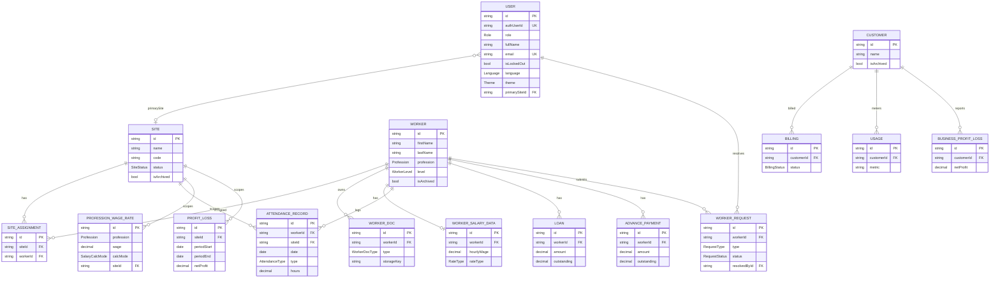

# SiteLink — Data Schema (SCHEMA.md)

**Phase:** 01 — Design (CREATE build)
**Owner:** Lattice (Schema)
**Reports to:** Origami (Designer) → Matrix (Architecture) → Manifest (PRD)
**Date:** 2026-07-12
**Status:** Authoritative data model — the single source of truth the back end and all front ends conform to.

Conforms to `docs/PRD.md` (Manifest) and `docs/ARCHITECTURE.md` (Matrix). Where the PRD's
illustrative SalaryRuleEngine contract (§11.1) and Matrix's variant (§4) differ, this schema
follows the **PRD FR-MGR-SRE §11.1 contract verbatim** (as instructed for Phase 01), and adopts
Matrix's **SCREAMING_SNAKE enum convention**.

---

## 0. Conventions

- **Enum values are `SCREAMING_SNAKE_CASE`** and match byte-for-byte across three artifacts:
  - `packages/shared/src/enums.ts` (TypeScript)
  - `backend/prisma/schema.prisma` (Prisma)
  - the tables in this document.
- **Timestamps:** every persisted entity has `createdAt` and `updatedAt`.
- **Soft-delete / Archives:** entities the PRD says can be "removed or moved to archives" carry
  `isArchived` (+ `archivedAt`). Archived rows are excluded from active rosters and dashboard
  counts (FR-MGR-EMP-6, FR-MGR-SITE-3).
- **Money:** stored as `Decimal(12,2)` (or wider) in Postgres; typed as `number` on the wire.
- **Dates:** date-only fields use Postgres `date`; instants use `timestamp`. On the wire, all are
  ISO-8601 strings (`ISODate`).
- **v1-active vs future:** `[v1]` powers the Manager surface + back end (build scope). `[future]`
  entities are modeled now to avoid migration churn (FR-REQ-3, FR-BO) but no surface consumes them
  in v1.
- **DB-shape vs wire-shape:** Prisma types stay in the backend; the hand-authored DTOs in
  `@sitelink/shared` are the wire contract (Architecture §2).
- **Auth split (Supabase):** SiteLink stores **no passwords**. `User` links to its Supabase Auth
  identity via `authUserId` (unique); Supabase owns credentials/sessions, this schema owns the
  role + site scope used for authorization (Architecture §5).
- **File storage (Supabase):** `FileRef` fields store the Supabase Storage **key/metadata**, not
  the bytes. Buckets are private; the back end mints short-lived signed URLs (Architecture §7a).

---

## 1. ER Overview (Mermaid)



---

## 2. Enums

All values are `SCREAMING_SNAKE_CASE`. Source: `packages/shared/src/enums.ts`.

| Enum | Values | PRD ref |
|---|---|---|
| `Role` | `ADMIN`, `MANAGER`, `PARTNER`, `FOREMAN`, `WORKER` | FR-X-RBAC, §5.9 |
| `Profession` | `IRONWORKER`, `MOLDER`, `CONCRETE_WORKER`, `GENERAL_LABORER`, `FOREMAN`, `MECHANIC`, `ELECTRICIAN`, `PLUMBER`, `OTHER` | FR-MGR-EMP-8 |
| `WorkerLevel` | `WEAK`, `MEDIUM`, `GOOD`, `EXCELLENT` | FR-MGR-EMP-9 |
| `AttendanceType` | `ATTENDANCE`, `VACATION`, `DISEASE` | FR-MGR-ATT-1/4 |
| `WorkerDocType` | `PASSPORT_ID`, `VISA`, `HEIGHT_PERMIT`, `ATTAT` | FR-MGR-EMP-3 |
| `SalaryCalcMode` | `ISRAELI_LABOR_LAW`, `FIXED` | FR-MGR-PAY-2 |
| `RateType` | `HOURLY`, `MONTHLY` | FR-MGR-EMP-4 |
| `SiteStatus` | `ACTIVE`, `ARCHIVED` | FR-MGR-SITE-2 |
| `RequestType` | `VACATION`, `LOAN`, `ADVANCE` | FR-REQ-1 |
| `RequestStatus` | `PENDING`, `APPROVED`, `REJECTED` | FR-REQ-1 |
| `Language` | `HE`, `EN`, `TR` | FR-X-I18N-1 |
| `Theme` | `LIGHT`, `DARK` | FR-X-THEME-1 |
| `BillingStatus` | `TRIALING`, `ACTIVE`, `PAST_DUE`, `CANCELED` | FR-BO-2 (future) |

> **SalaryCalcMode wire form.** The SalaryRuleEngine DTOs use the PRD §11.1 wire literals
> `'israeli-labor-law' | 'fixed'` (type `SalaryMode`). Persisted records use the `SalaryCalcMode`
> enum above; `toSalaryMode` / `fromSalaryMode` in `salary.ts` map between them.

---

## 3. Entities

Legend: **PK** primary key, **FK** foreign key, **UK** unique. Type column is the wire (TS) type.

### 3.1 User — `[v1]` (Users & Auth; FR-MGR-USER, FR-X-RBAC)

| Field | Type | Notes |
|---|---|---|
| id | ID (PK) | cuid |
| authUserId | ID (UK) | Supabase Auth user id — identity FK (Architecture §5); no password stored here |
| role | Role | server-enforced permissions (FR-MGR-USER-5) |
| fullName | string | |
| email | string (UK) | unique per user (FR-MGR-USER-4) |
| isLockedOut | boolean | reversible lockout (FR-MGR-USER-3) |
| primarySiteId | ID? (FK→Site) | construction site captured at creation (FR-MGR-USER-1) |
| language | Language | persisted preference (FR-X-I18N-3) |
| theme | Theme | persisted preference (FR-X-THEME-2) |
| lastLoginAt | ISODate? | |
| createdAt / updatedAt | ISODate | |

Manager can create Foreman/Worker/Partner/Admin users though their apps are future (FR-MGR-USER-1, scope §3.1).

### 3.2 Site — `[v1]` (FR-MGR-SITE) — *Archivable*

| Field | Type | Notes |
|---|---|---|
| id | ID (PK) | |
| name | string | site name/identifier (FR-MGR-SITE-2) |
| code | string? | optional identifier |
| status | SiteStatus | ACTIVE / ARCHIVED (FR-MGR-SITE-2) |
| address | string? | |
| startedAt | ISODate? | |
| isArchived / archivedAt | boolean / ISODate? | excluded from default dashboard (FR-MGR-SITE-3) |
| createdAt / updatedAt | ISODate | |

### 3.3 SiteAssignment — `[v1]` (worker ⇄ site many-to-many; FR-MGR-SITE-4)

| Field | Type | Notes |
|---|---|---|
| id | ID (PK) | |
| siteId | ID (FK→Site) | |
| workerId | ID (FK→Worker) | |
| assignedAt | ISODate | |
| unassignedAt | ISODate? | |

Unique on `(siteId, workerId)`. Drives per-site rollups (FR-MGR-SITE-4, FR-MGR-DASH-3).

### 3.4 Worker — `[v1]` (Worker Details; FR-MGR-EMP-2) — *Archivable*

| Field | Type | Notes |
|---|---|---|
| id | ID (PK) | |
| image | FileRef? | profile image, upload or camera (FR-MGR-EMP-2) |
| firstName | string | **required** (FR-MGR-EMP-7) |
| lastName | string | **required** (FR-MGR-EMP-7) |
| country | string? | |
| address | string? | |
| profession | Profession | **required** (FR-MGR-EMP-7/8) |
| level | WorkerLevel | WEAK/MEDIUM/GOOD/EXCELLENT (FR-MGR-EMP-9) |
| qualityOfWorks | string? | "Quality of works" (FR-MGR-EMP-2) |
| phone | string? | |
| email | string? | |
| personnelCompany | string? | personnel/staffing company (FR-MGR-EMP-2) |
| residence | string? | (FR-MGR-EMP-2) |
| startDate | ISODate? | date of starting work (FR-MGR-EMP-2) |
| isArchived / archivedAt | boolean / ISODate? | move-to-archives (FR-MGR-EMP-5/6) |
| createdAt / updatedAt | ISODate | |

`FileRef` is stored on Worker as `imageStorageKey/imageFileName/imageMimeType/imageUploadedAt`.

### 3.5 WorkerDoc — `[v1]` (Worker Docs; FR-MGR-EMP-3)

| Field | Type | Notes |
|---|---|---|
| id | ID (PK) | |
| workerId | ID (FK→Worker) | |
| type | WorkerDocType | PASSPORT_ID / VISA / HEIGHT_PERMIT / ATTAT |
| reference | string? | document number |
| expiresAt | ISODate? | e.g. visa/permit expiry |
| file (FileRef) | storageKey, fileName, mimeType, sizeBytes?, uploadedAt | Supabase Storage key + metadata (not bytes); retains file type + upload timestamp (FR-MGR-EMP-3); private bucket, back-end-signed URLs (NFR-SEC-4) |
| createdAt / updatedAt | ISODate | |

### 3.6 WorkerSalaryData — `[v1]` (Worker Salary; FR-MGR-EMP-4)

| Field | Type | Notes |
|---|---|---|
| id | ID (PK) | |
| workerId | ID (FK→Worker, UK) | one per worker |
| hourlyWage | number (Decimal) | (FR-MGR-EMP-4) |
| rateType | RateType | HOURLY / MONTHLY |
| workingConditions | string? | (FR-MGR-EMP-4) |
| currency | string | default `ILS` (A-2) |
| createdAt / updatedAt | ISODate | |

### 3.7 AttendanceRecord — `[v1]` (Attendance/Vacation/Disease; FR-MGR-ATT)

| Field | Type | Notes |
|---|---|---|
| id | ID (PK) | |
| workerId | ID (FK→Worker) | |
| siteId | ID? (FK→Site) | attributes hours to a site for rollups |
| date | ISODate (date) | the day (FR-MGR-ATT-1) |
| type | AttendanceType | ATTENDANCE / VACATION / DISEASE |
| hours | number? | hours worked when type = ATTENDANCE (feeds salary + rollups) |
| notes | string? | |
| createdAt / updatedAt | ISODate | |

**Exclusivity:** unique `(workerId, date)` — exactly one state per worker/day (FR-MGR-ATT-4).

### 3.8 WorkingHours (derived) — `[v1]` (FR-MGR-ATT-2/3)

Not a persisted table — a computed aggregate over `AttendanceRecord`, keyed by grain
`DAY | WEEK | MONTH`. Wire type `WorkingHours` in `attendance.ts` returns `totalHours`,
`attendanceDays`, `vacationDays`, `diseaseDays` per bucket. Feeds the dashboard work-hours rollup
(FR-MGR-DASH-3) and salary inputs (FR-MGR-ATT-3).

### 3.9 ProfessionWageRate — `[v1]` (Payment Management; FR-MGR-PAY-1/2/3)

| Field | Type | Notes |
|---|---|---|
| id | ID (PK) | |
| profession | Profession | wage by profession (FR-MGR-PAY-1) |
| wage | number (Decimal) | |
| rateType | RateType | |
| calcMode | SalaryCalcMode | ISRAELI_LABOR_LAW / FIXED (FR-MGR-PAY-2) |
| currency | string | default `ILS` |
| siteId | ID? (FK→Site) | null = global |
| createdAt / updatedAt | ISODate | |

Unique on `(profession, siteId)`.

### 3.10 SalaryRuleEngine DTOs — `[v1]` (FR-MGR-SRE §11.1) — *not persisted*

Computed on demand; the UI never computes pay inline (FR-MGR-PAY-4). Contract mirrors PRD §11.1 verbatim.

**SalaryInput**

| Field | Type | Notes |
|---|---|---|
| workerId | string | |
| siteId | string? | |
| periodStart / periodEnd | ISODate | |
| mode | `'israeli-labor-law' \| 'fixed'` | SalaryMode wire literals |
| hoursByDay | `{ date, hours, status: 'attendance'\|'vacation'\|'disease' }[]` | |
| hourlyWage | number | resolved rate (by worker or profession) |
| fixedSalary | number? | used when mode = `'fixed'` |
| currency | string | |

**SalaryResult**

| Field | Type | Notes |
|---|---|---|
| gross | number | |
| breakdown | `{ label, amount }[]` | base / overtime / deductions |
| currency | string | |
| mode | SalaryMode | |
| engineVersion | string | includes `'stub'` marker in v1 (FR-MGR-SRE-4) |
| computedAt | ISODate | |

Interface: `SalaryRuleEngine.compute(input: SalaryInput): SalaryResult` (FR-MGR-SRE-1). Strategies
`fixed` / `israeli-labor-law` selected by config, never by request (FR-MGR-SRE-2/3).

### 3.11 Loan — `[v1]` (FR-MGR-LOAN)

| Field | Type | Notes |
|---|---|---|
| id | ID (PK) | |
| workerId | ID (FK→Worker) | |
| amount | number (Decimal) | (FR-MGR-LOAN-1) |
| currency | string | |
| date | ISODate (date) | |
| notes | string? | optional (FR-MGR-LOAN-1) |
| outstanding | number (Decimal) | contributes to workforce rollup (FR-MGR-LOAN-3) |
| createdAt / updatedAt | ISODate | |

### 3.12 AdvancePayment — `[v1]` (FR-MGR-ADV)

Same shape as Loan; `outstanding` feeds the finance/workforce rollup (FR-MGR-ADV-3).

### 3.13 ProfitLoss (site-level) — `[v1]` (FR-MGR-PNL)

| Field | Type | Notes |
|---|---|---|
| id | ID (PK) | |
| siteId | ID? (FK→Site) | null = all-sites |
| periodStart / periodEnd | ISODate (date) | scope (FR-MGR-PNL-1) |
| currency | string | |
| revenue | number | revenue source refined by Architecture (A-3) |
| salaryCost / loansCost / advancesCost / otherCost | number | cost inputs (FR-MGR-PNL-2) |
| netProfit | number | revenue − total cost |
| createdAt / updatedAt | ISODate | |

May be computed on-demand or persisted as periodic snapshots. Exportable to PDF (FR-MGR-PNL-3).

### 3.14 WorkerRequest — `[future / modeled]` (§10a FR-REQ)

| Field | Type | Notes |
|---|---|---|
| id | ID (PK) | |
| workerId | ID (FK→Worker) | |
| requestedById | ID? | Worker user who submitted (v2) |
| type | RequestType | VACATION / LOAN / ADVANCE |
| status | RequestStatus | PENDING / APPROVED / REJECTED (FR-REQ-1) |
| amount / currency | number? / string? | for LOAN / ADVANCE |
| startDate / endDate | ISODate? | for VACATION |
| notes | string? | |
| resolvedById | ID? (FK→User) | resolver (FR-REQ-2) |
| resolvedAt | ISODate? | |
| resolutionNotes | string? | |
| createdAt / updatedAt | ISODate | |

Modeled now to avoid migration churn (FR-REQ-3, R-5). No Worker/Admin UI in v1.

### 3.15 Customer / Billing / Usage / BusinessProfitLoss — `[future / modeled]` (§10 FR-BO)

- **Customer** *(Archivable)* — SaaS tenant: name, contactEmail?, contactPhone?, registeredAt,
  leftAt?, isArchived (FR-BO-1/2).
- **Billing** — customerId, status (BillingStatus), plan, amount, currency, periodStart/End
  (FR-BO-2). No real payment provider in v1.
- **Usage** — customerId, metric, value, period (FR-BO-2/3).
- **BusinessProfitLoss** — SaaS-business P&L: customerId?, period, revenue, cost, netProfit
  (FR-BO-4). Distinct from the Manager-facing site-level `ProfitLoss` (3.13).

---

## 4. v1-active vs future summary

| Entity | Status |
|---|---|
| User, Site, SiteAssignment | v1 |
| Worker, WorkerDoc, WorkerSalaryData | v1 |
| AttendanceRecord, WorkingHours (derived) | v1 |
| ProfessionWageRate, SalaryRuleEngine DTOs | v1 |
| Loan, AdvancePayment, ProfitLoss (site) | v1 |
| WorkerRequest | future (modeled) |
| Customer, Billing, Usage, BusinessProfitLoss | future (modeled) |

---

## 5. Source files

- Shared TS types/enums: `packages/shared/src/*.ts` (barrel `index.ts`).
- Prisma schema: `backend/prisma/schema.prisma`.
- This document: `docs/SCHEMA.md`.

Keep all three in lockstep: any enum value or field change must land in all of them together.
```
